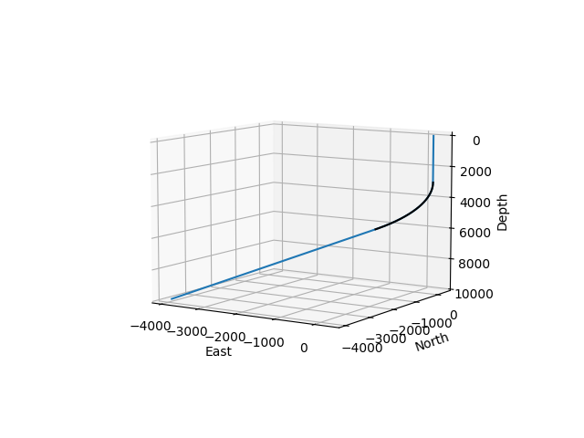

# 🛢️ Directional Drilling: 3D Well Path Visualization & Collision Detection

This project provides tools for 3D visualization of directional well trajectories and safety checks for well collision and proximity detection. Designed for subsurface engineers and drilling planners, it helps in analyzing planned vs actual paths and identifying critical spacing issues in dense well environments.

## 🚀 Features

### 📍 1. 3D Well Profile Plotting
- Visualizes the trajectory of a single well in 3D space using Easting, Northing, and Depth.
- Supports plotting both **planned** and **actual** well paths for comparison.
- Depth axis is inverted to match subsurface visualization standards.
- Useful for trajectory validation and directional drilling QA/QC.

### 🛑 2. Multi-Well Collision & Proximity Detection
- Loads multiple well trajectories and plots them together in 3D.
- Calculates pairwise distances between wells at various measured depths.
- Flags:
  - **Intersections** if two well paths intersect or overlap.
  - **Proximity alerts** if any two wells are closer than **10 feet** apart.
- Ideal for avoiding collisions, planning infill wells, or ensuring regulatory spacing.

## 🖼️ Sample Visualizations

